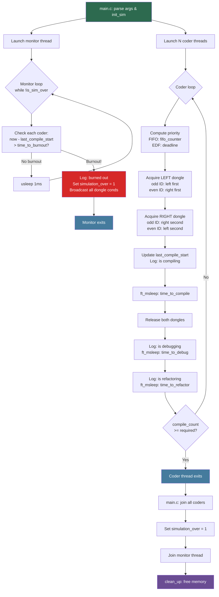

_This project has been created as part of the 42 curriculum by rhlou._

# Codexion

> *Master the race for resources before the deadline masters you.*
A **dining-philosophers-style concurrency simulation** in C, reframed as coders competing for USB dongles in a co-working hub. Built as part of the 42 / 1337 curriculum.

---

## Description

- **N coders** sit in a circle, each running as a **pthread thread**.
- **N dongles** lie between adjacent coders (one between each pair).
- To **compile**, a coder must hold **both** their left and right dongles simultaneously.
- After compiling → **debug** → **refactor** → repeat.
- A coder **burns out** if they go more than `time_to_burnout` ms without starting a compile.
- The simulation ends when a coder burns out, or when all coders have reached `number_of_compiles_required`.

---

## 🔄 Simulation Flow


---


## Instructions

```
./codexion <number_of_coders> <time_to_burnout> <time_to_compile> \
           <time_to_debug> <time_to_refactor> <number_of_compiles_required> \
           <dongle_cooldown> <scheduler>
```

### Arguments

| Argument | Unit | Description |
|---|---|---|
| `number_of_coders` | — | Number of coders and dongles |
| `time_to_burnout` | ms | Max time without compiling before a coder burns out |
| `time_to_compile` | ms | Duration of the compile phase (holds both dongles) |
| `time_to_debug` | ms | Duration of the debug phase |
| `time_to_refactor` | ms | Duration of the refactor phase |
| `number_of_compiles_required` | — | Target compile count per coder (-1 = run until burnout) |
| `dongle_cooldown` | ms | Time a dongle is unavailable after being released |
| `scheduler` | — | `fifo` (arrival order) or `edf` (earliest deadline first) |

### Examples

```bash
# 5 coders, FIFO scheduler, 3 compiles each
./codexion 5 800 200 100 100 3 50 fifo

# 3 coders, EDF scheduler, run until burnout
./codexion 3 500 100 50 50 -1 0 edf
```

---

## 📝 Output Format

Every event is printed to stdout as:
```
timestamp_ms  coder_id  event
```

Events:
```
142 3 is compilingj
342 3 is debugging
442 3 is refactoring
801 1 burned out
```

- Timestamps are in milliseconds from simulation start.
- Output is protected by a mutex — lines never interleave.
- The burnout message appears within 10ms of the actual burnout.

---

## 🏗️ Architecture

```
src/
├── main.c        — arg validation, init, thread launch and join
├── init.c        — allocate/init sim, coders, dongles, mutexes
├── coder.c       — coder thread routine (compile/debug/refactor loop)
├── monitor.c     — monitor thread watching for burnout
├── dongle.c      — dongle_acquire / dongle_release with wait queue
├── scheduler.c       — min-heap priority queue (EDF & FIFO support)
├── scheduler_utils.c — heap helper functions
├── log.c             — thread-safe log_event
├── utils.c           — time and state helpers
└── utils2.c          — string helpers (ft_atoi)

include/
└── codexion.h    — all structs and prototypes
```

---

## Thread synchronization mechanisms

### Deadlock Prevention — Odd/Even Dongle Order
Each coder grabs their two dongles in a specific order based on their ID:
- **Even coders**: grab left dongle first, then right.
- **Odd coders**: grab right dongle first, then left.

This breaks the circular wait condition that causes deadlock.

### Wait Queue — Min-Heap Per Dongle
Each dongle has its own **min-heap priority queue**. When a coder wants to compile:
1. They push themselves onto the dongle's heap with a priority.
2. They sleep on a `pthread_cond_wait` until they are at the top of the heap **and** the dongle is available **and** the cooldown has expired.
3. When they acquire the dongle, they pop themselves off the heap.
4. When they release the dongle, they broadcast to wake all waiting coders.

### Schedulers

| Mode | Priority Formula | Behavior |
|---|---|---|
| `fifo` | Global counter (arrival order) | First to arrive, first served |
| `edf` | `last_compile_start + time_to_burnout` | Most urgent coder (closest to burnout) served first |

---

## Blocking cases handled

The simulation correctly avoids classic deadlocks through the asymmetric acquisition (even/odd dongle ordering).
It handles high contention starvation by providing an EDF (Earliest Deadline First) scheduler to prioritize coders closer to burning out.
Single coder configurations are explicitly rejected to prevent structural self-blocking (as one coder cannot compile with a single dongle).

## 🚀 Advanced Features & Optimizations

### Thread Creation Failure Handling
If the OS restricts thread creation (e.g., via `ulimit -u`), the simulation catches `pthread_create` failures safely, aborting the process instead of hanging or segfaulting in cleanup.

### Starvation Race Condition Prevention
A classic multi-threading edge case exists where a starving coder wakes up to grab a dongle at the exact millisecond their burnout expires, updating their `last_compile_start` a microsecond before the monitor thread checks on them, effectively "cheating death". This project explicitly handles this: coders self-check their burnout deadline before updating their timer, yielding to the monitor if they starved.

### Efficient Resource Management
The simulation implements memory-efficient priority queues pre-allocated based on the number of coders, adhering to strict libc function constraints (avoiding `realloc`) while eliminating allocation overhead during runtime.

---

## Resources

- Documentation for `pthread` API
- POSIX standard references for threading behavior
- Generative AI was used extensively during the development and iteration of this codebase. Antigravity AI analyzed edge cases, proposed concurrency designs (like EDF wait queues and even-odd deadlock prevention), diagnosed thread-safety races, and maintained code formatting against the 42 Norm standards.

## 🛠️ Build

```bash
make        # build the binary
make clean  # remove object files
make fclean # remove objects + binary
make re     # fclean + build
```

Object files are output to `objects/`.

---

## 👤 Author

**rhlou** — rhlou@student.42.fr — 1337 / 42 Network
